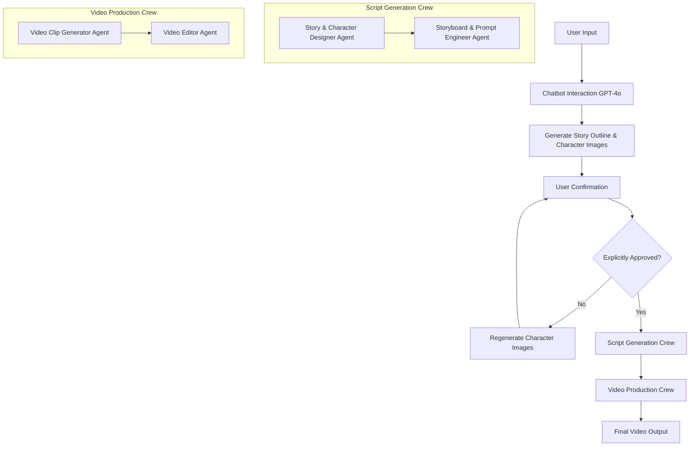

# Design Document

## Overview

The Spark AI Video Generation Pipeline is designed as a multi-stage, AI-orchestrated system that transforms user creative ideas into complete video narratives. The system leverages CrewAI's Flow architecture to coordinate multiple specialized AI agents, each responsible for specific aspects of the video creation process. The design emphasizes modularity, error resilience, and clear separation of concerns while maintaining a smooth user experience from concept to final video.

## Architecture

### High-Level Architecture

The system follows a three-phase pipeline architecture:

1. **Interactive Ideation Phase**: GPT-4o powered chatbot for user interaction and structured JSON output
2. **Confirmation Phase**: User review and explicit approval of story outline and character visual designs
3. **Production Phase**: CrewAI orchestrated multi-agent video generation with automated script development and video assembly



### Flow-Based Architecture

The system utilizes CrewAI's Flow pattern to manage state transitions and coordinate between different phases:

```python
class VideoGenerationState(BaseModel):
    # Stage 1: User idea and approval
    user_idea: UserIdea = UserIdea()
    approved_content: ApprovedContent = ApprovedContent()
    
    # Stage 2: Story expansion (coherent narrative text)
    detailed_story: DetailedStory = DetailedStory()
    
    # Stage 3: Shot breakdown and prompt generation
    video_prompts: List[VideoPrompt] = []
    video_clip_urls: List[str] = []
    final_video_path: str = ""
```

## Components and Interfaces

### 1. Chatbot Module (`src/spark/chatbot/`)

**Purpose**: Interactive user engagement, idea structuring, and complete character profile generation

**Key Components**:
- `ChatbotCore`: Main interaction logic using GPT-4o
- `IdeaStructurer`: Converts natural language to structured JSON
- `CharacterProfileGenerator`: Creates comprehensive character profiles with images
- `PromptTemplates`: Standardized prompts for consistent interaction

**Design Rationale**: The chatbot module serves as the primary user interface, transforming natural language input into structured data. GPT-4o was selected for its superior conversational abilities and structured output generation. The module generates both textual descriptions and visual character images during the ideation phase to enable immediate user confirmation before proceeding to production.

**Interface**:
```python
class ChatbotCore:
    def engage_user(self, initial_input: str) -> dict
    def ask_clarifying_questions(self, current_idea: dict) -> str
    def structure_idea(self, conversation_history: List[str]) -> dict
    def generate_complete_character_profiles(self, characters: List[dict]) -> List[CharacterProfile]
```

### 2. Script Generation Crew (`src/spark/crews/script/`)

**Agents**:

**Story Expansion Agent**:
- Model: Qwen3
- Responsibilities: Expand approved story outline narrative into complete, detailed story text
- Tools: Qwen3Tool
- Input: StoryOutline.narrative_text + CharacterProfiles
- Output: DetailedStory.full_story_text
- Constraints: Must strictly follow the approved story outline without adding new characters or major plot changes

**Shot Breakdown & Prompt Generation Agent**:
- Model: Qwen3
- Responsibilities: 1) Break detailed story into individual shots, 2) Convert shots into VEO3-optimized prompts with character context
- Tools: Qwen3Tool
- Input: DetailedStory.full_story_text + CharacterProfiles (with images)
- Output: List[VideoPrompt] with character reference images attached
- Process: Coherent story text → Shot breakdown → VEO3 prompts with character descriptions and reference images

**Interface**:
```python
class ScriptGenerationCrew:
    def expand_story_narrative(self, approved_content: ApprovedContent) -> DetailedStory
    def break_into_shots_and_generate_prompts(self, detailed_story: DetailedStory, character_profiles: List[CharacterProfile]) -> List[VideoPrompt]
```

### 3. Video Production Crew (`src/spark/crews/maker/`)

**Agents**:

**Video Clip Generator Agent**:
- Model: VEO3
- Responsibilities: Generate individual video clips from prompts using approved character images as visual reference
- Tools: VEO3Tool, VideoProcessingTool, ImageReferenceTool
- Context: Uses approved character images to maintain visual consistency across all generated video clips

**Video Editor Agent**:
- Tools: MoviePy, FFmpeg wrappers
- Responsibilities: Concatenate clips, apply transitions, format conversion
- Tools: VideoEditingTool, FileManagementTool

**Interface**:
```python
class VideoProductionCrew:
    def generate_video_clips(self, prompts: List[VideoPrompt]) -> List[str]
    def assemble_final_video(self, clip_urls: List[str]) -> str
    def ensure_visual_consistency(self, prompts: List[VideoPrompt]) -> List[VideoPrompt]
```

### 4. Tools Module (`src/spark/tools/`)

**External API Wrappers**:

```python
class VEO3Tool:
    def generate_video_clip(self, video_prompt: VideoPrompt) -> str
    def generate_with_professional_specs(self, video_prompt: VideoPrompt, reference_images: List[str]) -> str
    def check_generation_status(self, job_id: str) -> dict
    def validate_prompt_compatibility(self, video_prompt: VideoPrompt) -> bool
    def optimize_generation_parameters(self, video_prompt: VideoPrompt) -> dict

class Qwen3Tool:
    def generate_text(self, prompt: str, context: dict) -> str
    def generate_structured_output(self, prompt: str, schema: dict) -> dict

class ImageGenerationTool:
    def generate_character_image(self, description: str, style: str) -> str
    def generate_scene_image(self, description: str) -> str


class VideoEditingTool:
    def concatenate_clips(self, clip_paths: List[str]) -> str
    def add_transitions(self, video_path: str, transition_type: str) -> str
    def convert_format(self, input_path: str, output_format: str) -> str
```

## Data Models

### Core Data Structures

```python
class UserIdea(BaseModel):
    theme: str
    genre: str
    target_audience: str
    duration_preference: int  # in seconds
    basic_characters: List[str]  # basic character descriptions from user
    plot_points: List[str]
    visual_style: str
    mood: str

class ApprovedContent(BaseModel):
    story_outline: StoryOutline
    character_profiles: List[CharacterProfile]
    user_confirmed: bool = False

class CharacterProfile(BaseModel):
    name: str
    role: str
    appearance: str
    personality: str
    backstory: str
    motivations: List[str]
    relationships: dict  # relationships with other characters
    image_url: str
    visual_consistency_tags: List[str]  # for maintaining visual consistency across scenes

class StoryOutline(BaseModel):
    title: str
    summary: str
    narrative_text: str  # Coherent story outline text that user sees and approves
    estimated_duration: int

class DetailedStory(BaseModel):
    title: str
    full_story_text: str  # Complete, detailed, coherent narrative text
    total_duration: int

class Shot(BaseModel):
    shot_id: int
    description: str  # What happens in this specific shot
    characters_present: List[str]
    location: str
    duration: int

class VideoPrompt(BaseModel):
    shot_id: int
    veo3_prompt: str  # Complete optimized prompt for VEO3 with character context
    duration: int
    character_reference_images: List[str]  # For visual consistency

class VideoClip(BaseModel):
    clip_id: int
    shot_id: int
    file_path: str
    duration: int
    status: str  # "generating", "completed", "failed"
    generation_job_id: Optional[str] = None
```

## Error Handling

### Retry Strategy

```python
class RetryConfig:
    max_retries: int = 3
    base_delay: float = 1.0
    max_delay: float = 60.0
    exponential_base: float = 2.0

class APIErrorHandler:
    def handle_api_failure(self, error: Exception, context: dict) -> bool
    def implement_exponential_backoff(self, attempt: int) -> float
    def handle_rate_limiting(self, retry_after: int) -> None
```

### Error Recovery Mechanisms

1. **API Failures**: Exponential backoff with jitter, alternative model fallbacks
2. **Video Generation Failures**: Prompt modification, alternative generation parameters
3. **File Operation Failures**: Temporary directory cleanup, disk space checks
4. **State Persistence**: Checkpoint system for resuming interrupted workflows

### Graceful Degradation

- If character image generation fails, proceed with text descriptions
- If specific video clips fail, generate placeholder clips or skip with user notification
- If final assembly fails, provide individual clips to user

## Testing Strategy

### Unit Testing

**Chatbot Module Tests**:
- Mock GPT-4o API responses
- Test idea structuring logic
- Validate prompt template rendering

**Crew Tests**:
- Mock external API calls
- Test agent task execution
- Validate data flow between agents

**Tools Tests**:
- Mock external API endpoints
- Test error handling scenarios
- Validate data transformation logic

### Integration Testing

**End-to-End Workflow Tests**:
- Complete pipeline execution with mock APIs
- State transition validation
- Error recovery testing

**API Integration Tests**:
- Real API calls with test data
- Rate limiting behavior
- Authentication and authorization

### Performance Testing

**Load Testing**:
- Concurrent user sessions
- API rate limit handling
- Memory usage optimization

**Video Processing Performance**:
- Large file handling
- Concurrent video generation
- Storage optimization

### Test Data Management

```python
class TestDataFactory:
    def create_sample_user_idea(self) -> UserIdea
    def create_sample_plot_outline(self) -> PlotOutline
    def create_sample_video_prompts(self) -> List[VideoPrompt]
    def create_mock_api_responses(self) -> dict
```

## Configuration Management

### Environment Configuration

```python
class Config:
    # API Configuration
    CHATBOT_API_KEY: str
    IMAGE_GEN_API_KEY: str
    DETAILED_STORY_API_KEY: str
    VIDEO_GENERATE_API_KEY: str
    
    # Model Configuration
    CHATBOT_MODEL: str = "gpt-4o"  # For user interaction and idea structuring
    IMAGE_GEN_MODEL: str = "dall-e-3"  # For character image generation
    DETAILED_STORY_MODEL: str = "qwen3-turbo"  # For story expansion and prompt generation
    VIDEO_GENERATE_MODEL: str = "veo3-standard"  # For video clip generation
    
    # Processing Configuration
    MAX_VIDEO_DURATION: int = 300  # seconds
    MAX_CONCURRENT_GENERATIONS: int = 3
    TEMP_STORAGE_PATH: str = "/tmp/spark_videos"
    
    # Retry Configuration
    API_RETRY_CONFIG: RetryConfig
```

### Model Switching Strategy

The system supports dynamic model switching based on availability and performance:

```python
class ModelManager:
    def get_available_models(self, model_type: str) -> List[str]
    def switch_model(self, model_type: str, new_model: str) -> bool
    def health_check_models(self) -> dict
```

## Security Considerations

### API Key Management
- Environment variable storage
- Key rotation support
- Secure key validation

### Content Safety
- Input sanitization for user ideas
- Content filtering for generated materials
- NSFW detection for character images

### Data Privacy
- Temporary file cleanup
- User data anonymization
- Secure API communication (HTTPS/TLS)

## Professional Video Prompt Engineering

### Prompt Engineering Approach

The system uses well-crafted prompts to the Qwen3 model to achieve professional cinematography results:

**1. Professional Prompt Templates**: Built-in cinematography knowledge through carefully designed system prompts that include:
- Shot composition principles (rule of thirds, framing, depth)
- Lighting design guidelines (three-point lighting, mood creation)
- Camera movement best practices
- Continuity management rules

**2. Structured Output**: The Storyboard & Prompt Engineer agent uses structured prompts to ensure consistent VideoPrompt generation with all required professional specifications.

**3. Context-Aware Generation**: Prompts include context from previous shots and approved character images to maintain visual consistency and narrative flow.

## Performance Optimization

### Caching Strategy
- Character image caching by description hash
- Plot outline caching for similar themes
- Video clip caching for repeated prompts
- Cinematography template caching

### Parallel Processing
- Concurrent video clip generation
- Asynchronous API calls
- Background file processing
- Parallel prompt optimization

### Resource Management
- Memory usage monitoring
- Temporary file cleanup
- Connection pooling for API calls
- Professional asset library management

## Flask后端API包装

### API接口设计

整个AI视频生成管道将被包装在Flask后端应用中，提供RESTful API接口供外部调用。

**核心组件**:

```python
class FlaskVideoAPI:
    def __init__(self):
        self.app = Flask(__name__)
        self.video_pipeline = VideoGenerationPipeline()
        self.setup_api_routes()
    
    def setup_api_routes(self):
        # RESTful API端点
        self.app.route('/api/chat', methods=['POST'])(self.chat_interaction)
        self.app.route('/api/confirm', methods=['POST'])(self.confirm_content)
        self.app.route('/api/regenerate-character', methods=['POST'])(self.regenerate_character)
        self.app.route('/api/generate-video', methods=['POST'])(self.start_video_generation)
        self.app.route('/api/status/<job_id>', methods=['GET'])(self.get_generation_status)
        self.app.route('/api/download/<video_id>', methods=['GET'])(self.download_video)
```

### API端点详细设计

```python
# 聊天机器人交互API
@app.route('/api/chat', methods=['POST'])
def chat_interaction():
    """
    处理用户与聊天机器人的交互
    输入: {"message": "用户输入", "session_id": "会话ID"}
    输出: {"response": "机器人回复", "structured_data": {...}, "is_complete": bool}
    """

# 内容确认API  
@app.route('/api/confirm', methods=['POST'])
def confirm_content():
    """
    用户确认故事大纲和角色设计
    输入: {"session_id": "会话ID", "approved": bool, "feedback": "反馈"}
    输出: {"status": "confirmed/rejected", "next_step": "..."}
    """

# 角色重新生成API
@app.route('/api/regenerate-character', methods=['POST'])
def regenerate_character():
    """
    重新生成特定角色的图像
    输入: {"character_name": "角色名", "feedback": "修改要求", "session_id": "会话ID"}
    输出: {"character_image_url": "新图像URL", "status": "success/failed"}
    """

# 视频生成启动API
@app.route('/api/generate-video', methods=['POST'])
def start_video_generation():
    """
    启动视频生成流程
    输入: {"session_id": "会话ID"}
    输出: {"job_id": "任务ID", "status": "started", "estimated_time": 300}
    """

# 生成状态查询API
@app.route('/api/status/<job_id>', methods=['GET'])
def get_generation_status(job_id):
    """
    查询视频生成进度
    输出: {"status": "processing/completed/failed", "progress": 0.75, "current_step": "..."}
    """

# 视频下载API
@app.route('/api/download/<video_id>', methods=['GET'])
def download_video(video_id):
    """
    下载生成的视频文件
    输出: 视频文件流或下载链接
    """
```

### 会话管理

```python
class APISessionManager:
    def create_session(self) -> str
    def store_session_data(self, session_id: str, data: dict)
    def get_session_data(self, session_id: str) -> dict
    def update_session_progress(self, session_id: str, step: str, progress: float)
    def cleanup_expired_sessions(self)
```

### 错误处理和响应格式

```python
# 标准API响应格式
class APIResponse:
    success: bool
    data: dict
    message: str
    error_code: Optional[str] = None

# 错误处理
@app.errorhandler(400)
def bad_request(error):
    return jsonify(APIResponse(success=False, message="请求参数错误", error_code="BAD_REQUEST"))

@app.errorhandler(500)
def internal_error(error):
    return jsonify(APIResponse(success=False, message="服务器内部错误", error_code="INTERNAL_ERROR"))
```

### 部署配置

```python
class FlaskAPIConfig:
    SECRET_KEY: str = os.environ.get('FLASK_SECRET_KEY')
    MAX_CONTENT_LENGTH: int = 16 * 1024 * 1024  # 16MB最大请求大小
    SESSION_TIMEOUT: int = 3600  # 1小时会话超时
    
    # API配置
    API_VERSION: str = "v1"
    RATE_LIMIT: str = "100 per hour"  # API调用频率限制
    
    # 生产环境设置
    DEBUG: bool = False
    TESTING: bool = False
    
    # 文件存储
    GENERATED_VIDEOS_PATH: str = 'generated_videos'
    TEMP_FILES_CLEANUP_INTERVAL: int = 3600  # 1小时
```

**设计理念**: Flask后端API设计专注于提供清晰、RESTful的接口，支持完整的视频生成工作流程。API设计遵循标准HTTP状态码和JSON响应格式，便于第三方集成和前端开发。会话管理确保多步骤工作流程的状态持久性，错误处理提供详细的错误信息和恢复建议。